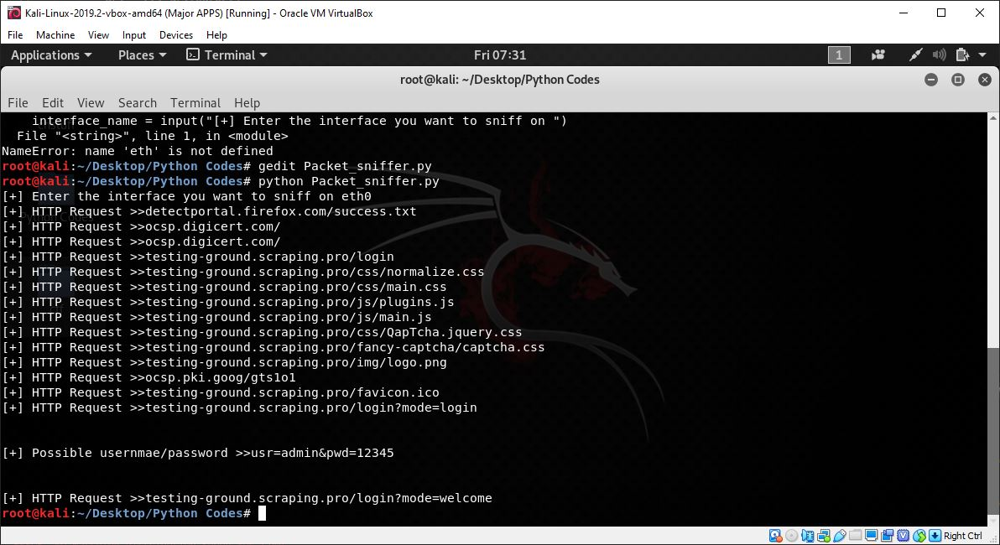

# Packet Sniffer 
 A Script that Sniffs for HTTP packets and also possible username and passwords entered by the victim  :scream: .
 
 **Requirements** 
 
 A requirements.py is been made ,run it before running the Script 
 * `python requirements.py`

**Script**
* `python Packet_sniffer.py`

